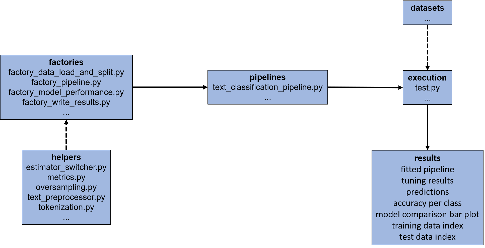

# pxtextmining: Text Classification of Patient Experience feedback.

## Project description
Nottinghamshire Healthcare NHS Foundation Trust hold  patient feedback that is currently manually labelled by our "coders" (i.e. the staff who read the feedback and decide what it is about). As we hold thousands of patient feedback records, we (the [Data Science team](https://cdu-data-science-team.github.io/team-blog/about.html)) are running this project to aid the coders with a text classification pipeline that will semi-automate the labelling process. We are also working in partnership with other NHS trusts who hold patient feedback text. Read more  [here](https://involve.nottshc.nhs.uk/blog/new-nhs-england-funded-project-in-our-team-developing-text-mining-algorithms-for-patient-feedback-data/) and [here](https://cdu-data-science-team.github.io/team-blog/posts/2020-12-14-classification-of-patient-feedback/).

__We are working openly by open-sourcing the analysis code and data where possible to promote replication, reproducibility and further developments (pull requests are more than welcome!). We are also automating common steps in our workflow by shipping the pipeline as a [`Python`](https://www.python.org/) package broken down into sub-modules and helper functions to increase usability and documentation.__

## Installation

1. To begin with, download the repo.
1. It is best to create a `Python` virtual environment. Let's call it `text_venv`.
   Open a terminal, navigate to the folder where you want to put the virtual 
   environment and run `python3 -m venv text_venv`.
1. Activate the virtual environment: `source text_venv/bin/activate`.
1. Navigate to the repo's parent folder and run 
   `pip install -r requirements.txt` (installs all the necessary
   `Python` packages in the virtual environment `text_venv`).
1. In the parent folder, run `python setup.py install` (installs `pxtextmining`
   as a `Python` package).

All steps in one go:

```
python3 -m venv text_venv
source text_venv/bin/activate
pip install -r requirements.txt
python setup.py install
```

## Execution

All execution scripts should be in folder "execution". The execution scripts are
nothing more than a call of function `pxtextmining.pipelines.text_classification_pipeline`
with user-specified arguments. The two example scripts, `execution_label.py` and
`execution_criticality.py` run the pipeline for each of the two target variables
in `datasets/text_data.csv`. Note that `execution_criticality.py` runs ordinal 
classification (`ordinal=True`).

The user can create their own execution script(s). Run the script in a Python 
IDE (Integrated Development Environment) or on the terminal (don't forget to 
activate the virtual environment) from the parent folder with 
`python3 -m pxtextmining/execution.<script_name_without_extension>`. For example, 
`python3 -m pxtextmining/execution.execution_label` (**do not add the `.py` extension!**).

## Pipeline

The pipeline is built with `Python`'s 
[`Scikit-learn`](https://scikit-learn.org/stable/index.html) (Pedregosa et al., 2011). 
During fitting, both the "Bag-of-Words" approach and a word embedding-based 
approach are tried out. The pipeline performs a random grid search ([`RandomizedSearchCV()`](https://scikit-learn.org/stable/modules/generated/sklearn.model_selection.RandomizedSearchCV.html#sklearn.model_selection.RandomizedSearchCV)) to identify the best-performing learner 
and (hyper)parameter values. The process also involves a few pre- and post-fitting steps:

1. Data load and split into training and test sets ([`factory_data_load_and_split.py`](https://github.com/CDU-data-science-team/positive_about_change_text_mining/blob/develop/factories/factory_data_load_and_split.py)).

2. Text pre-processing (e.g. remove special characters, whitespaces and line breaks) and tokenization, token lemmatization, calculation of Term Frequency–Inverse Document Frequencies (TF-IDFs), up-balancing of rare classes, feature selection, pipeline training and learner benchmarking ([`factory_pipeline.py`](https://github.com/CDU-data-science-team/positive_about_change_text_mining/blob/develop/factories/factory_pipeline.py)).

3. Evaluation of pipeline performance on test set, production of evaluation 
metrics (Accuracy score, 
[Class Balance Accuracy](https://lib.dr.iastate.edu/cgi/viewcontent.cgi?article=4544&context=etd) (Mosley, 2013), 
[Balanced Accuracy](https://scikit-learn.org/stable/modules/generated/sklearn.metrics.balanced_accuracy_score.html) (Guyon et al., 2015, Kelleher et al., 2015) or 
[Matthews Correlation Coefficient](https://scikit-learn.org/stable/modules/generated/sklearn.metrics.matthews_corrcoef.html) (Baldi et al., 2000, Matthews, 1975)) and plots, and fitting of best performer 
on whole dataset 
([`factory_model_performance.py`](https://github.com/CDU-data-science-team/positive_about_change_text_mining/blob/develop/factories/factory_model_performance.py)).

4. Writing the results: fitted pipeline, tuning results, predictions, accuracy 
per class, model comparison bar plot, training data index, and test data index ([`factory_write_results.py`](https://github.com/CDU-data-science-team/positive_about_change_text_mining/blob/develop/factories/factory_write_results.py)).

There are a few helper functions and classes available in the [helpers](https://github.com/CDU-data-science-team/positive_about_change_text_mining/tree/develop/helpers) 
folder that the aforementioned factories make use of.

The factories are brought together in a single function [`text_classification_pipeline.py`](https://github.com/CDU-data-science-team/positive_about_change_text_mining/tree/develop/pipelines) that runs the whole process. This function can be run in a user-made 
script such as 
[`test.py`](https://github.com/CDU-data-science-team/positive_about_change_text_mining/tree/develop/execution). 
The text dataset is loaded either as CSV from folder [datasets](https://github.com/CDU-data-science-team/positive_about_change_text_mining/tree/develop/datasets) 
or is loaded directly from the database. The former practice is _not_ recommended, 
because `Excel` can cause all sorts of issues with text encodings. The [results](https://github.com/CDU-data-science-team/positive_about_change_text_mining/tree/develop/results) 
folder always contains a SAV of the fitted model and a PNG of the learner 
comparison bar plot. Results in tabular form are typically saved in the database, 
unless the user chooses to write them as CSV files in the "results" folder. 
All results files have a "_target_variable_name" suffix, for example 
"tuning_results_label" if the dependent variable is `label`.

Here is a visual display of the process:



## References
Baldi P., Brunak S., Chauvin Y., Andersen C.A.F. & Nielsen H. (2000). Assessing 
the accuracy of prediction algorithms for classification: an overview. 
_Bioinformatics_  16(5):412–424.

Guyon I., Bennett K. Cawley G., Escalante H.J., Escalera S., Ho T.K., Macià N., 
Ray B., Saeed M., Statnikov A.R, & Viegas E. (2015). [Design of the 2015 ChaLearn AutoML Challenge](https://ieeexplore.ieee.org/document/7280767), 
International Joint Conference on Neural Networks (IJCNN).

Kelleher J.D., Mac Namee B. & D’Arcy A.(2015). 
[Fundamentals of Machine Learning for Predictive Data Analytics: Algorithms, Worked Examples, and Case Studies](https://mitpress.mit.edu/books/fundamentals-machine-learning-predictive-data-analytics). 
MIT Press.

Matthews B.W. (1975). Comparison of the predicted and observed secondary 
structure of T4 phage lysozyme. _Biochimica et Biophysica Acta (BBA) - Protein Structure_ 
405(2):442–451.

Pedregosa F., Varoquaux G., Gramfort A., Michel V., Thirion B., Grisel O., 
Blondel M., Prettenhofer P., Weiss R., Dubourg V., Vanderplas J., Passos A., 
Cournapeau D., Brucher M., Perrot M. & Duchesnay E. (2011), 
[Scikit-learn: Machine Learning in Python](https://jmlr.csail.mit.edu/papers/v12/pedregosa11a.html). 
_Journal of Machine Learning Research_ 12:2825–2830
