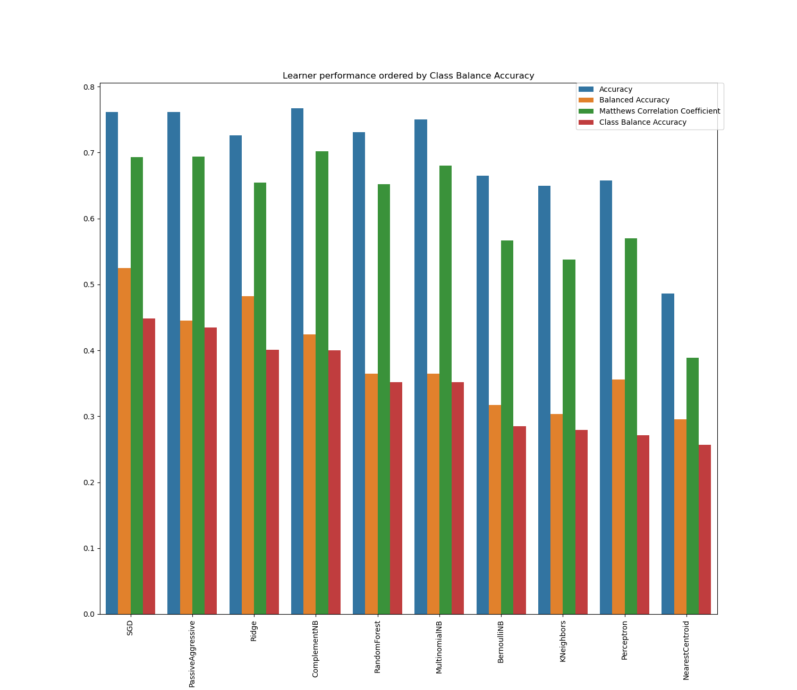

# positive_about_change_text_mining

## Project description
Nottinghamshire Healthcare NHS Foundation Trust hold  patient feedback that is currently manually labelled by our "coders" (i.e. the staff who read the feedback and decide what it is about). As we hold thousands of patient feedback records, we (the Data Science team) are running this project to aid the coders with a text classification model that will semi-automate the labelling process. Read more [here](https://involve.nottshc.nhs.uk/blog/new-nhs-england-funded-project-in-our-team-developing-text-mining-algorithms-for-patient-feedback-data/).

This project will build and benchmark a number of text classification models using state-of-the-art Machine Learning (ML) packages in [`Python`](https://www.python.org/) and [`R`](https://www.r-project.org/). The final products will be the following:

1. An interactive dashboard that will make the findings of complex ML models accessible to non-technical audiences.
2. Open Source code that other NHS trusts will be able to use for analyzing their own patient feedback records.

## Technical
A few avenues are currently explored with `R` and `Python`:

1. Python's [`scikit-learn`](https://scikit-learn.org/stable/index.html). At this point, the script benchmarks ML models able to efficiently handle large sparse matrices ("bag-of-words" approach). We intend to expand this to other approaches, e.g. [`Keras`](https://keras.io/)/[`BERT`](https://pypi.org/project/keras-bert/), [`spaCy`](https://spacy.io/), [`TextBlob`](https://textblob.readthedocs.io/en/dev/quickstart.html#words-inflection-and-lemmatization) etc.
2. Benchmarking of different algorithms with R package [`mlr3`](https://github.com/mlr-org]).
3. Facebook's [StarSpace](https://github.com/facebookresearch/StarSpace) with R package [`ruimtehol`](https://github.com/bnosac/ruimtehol).
4. [`Quanteda`'s](https://quanteda.io/index.html) implementation of Multinomial Naive Bayes (https://tutorials.quanteda.io/machine-learning/nb/).

The data is [here](https://github.com/ChrisBeeley/naturallanguageprocessing/blob/master/cleanData.Rdata) and that's where it will stay until GitHub stops crashing when I try to upload them to this project!

### Preliminary findings

The learners in `Python` are immensely more efficient than their `R` counterparts and building pipelines with `scikit-learn` is pretty straightforward. Moreover, `Python` offers a much wider range of options for text preprocessing and mining.

##### A first pipeline
For a starter, we built a simple pipeline with learners that can efficiently handle large sparse matrices ("bag-of-words" approach). The pipeline does some preprocessing for text tokenization/lemmatization, word frequencies etc. and benchmarks learners with a 5-fold cross-validation and an appropriate score for imbalanced datasets ([Class Balance Accuracy](https://lib.dr.iastate.edu/cgi/viewcontent.cgi?article=4544&context=etd), [Balanced Accuracy](https://scikit-learn.org/stable/modules/generated/sklearn.metrics.balanced_accuracy_score.html) or [Matthews Correlation Coefficient](https://scikit-learn.org/stable/modules/generated/sklearn.metrics.matthews_corrcoef.html)) or with the standard Accuracy score (classes correctly predicted over number of records). Fitting the pipeline using Class Balance Accuracy as the scorer, we find that the best model is a Linear SVC classifier:

The optimal (hyper)parameter values for the best model and rest of learners, as well as other metrics (fit time, scores per cross-validation fold etc.) are in [tuning_results_first_pipeline.csv](https://github.com/CDU-data-science-team/positive_about_change_text_mining/blob/master/tuning_results_first_pipeline.csv).

**A few things to note:**

1. We used a custom tokenizer in [`TfidfVectorizer()`](https://scikit-learn.org/stable/modules/generated/sklearn.feature_extraction.text.TfidfVectorizer.html) that allows the user to choose between `spaCy` and `Wordnet` (see [`NLTK`](https://www.nltk.org/)) for tokenization and lemmatization. The algorithm of `spaCy` is faster and also led to marginally higher classifier performances. Therefore, there is no reason to have the pipeline switch between `spaCy` and `Wordnet`, so future imrpovements to the pipeline will have `spaCy`'s tokenizer/lemmatizer as the default.
2. More often than not, we ran into convergence issues with [`LinearSVC()`](https://scikit-learn.org/stable/modules/generated/sklearn.svm.LinearSVC.html)- even with `max_iter=10000`. There is an ongoing discussion [here](https://github.com/scikit-learn/scikit-learn/issues/11536) (see _hermidalc_'s comment on 20 April 2020). As a safety measure, we will not be considering this learner in subsequent runs.

#### `R` is not a good option
We soon concluded that building the ML pipelines in `R` would be incomplete and inefficient:

1. **`mlr3`.** The text tokenizer pipe operator in `mlr3pipelines` is [slow](https://github.com/mlr-org/mlr3pipelines/issues/511) and the readily available models in `mlr3learners` and `mlr3extralearners` are very inefficient with sparse matrices.
2. **`ruimtehol`.** The accuracy of the StarSpace model does not exceed 59% in both superviser and semi-supervised settings.
3. **`Quanteda`.** The Multinomial Naive Bayes model in `quanteda.textmodels` is extremely fast. However, `Quanteda` does not (yet?) offer options for a fully automated pipeline that would deal with issues such as train-test data leakage etc.

Therefore, the `R` scripts are, and will probably remain, experimental, so don't be surprised if the chunks of the code contain errors, are cryptic or don't work at all, or if the models aren't appropriate or don't perform _that_ great.

Further details in the Appendix.

## Appendix
### `mlr3` (R)
The pipeline performs data pre-processing (e.g. one-hot encode dates, if a date column is used; tokenize text and get word frequencies; etc.) and then benchmarks a number of classification algorithms. Five algorithms were considered:

| Model                                                 | Issues      | Verdict     |
| :-------------                                        | :---------- | ----------- |
| Generalized Linear Models with Elastic Net (GLM NET) | Something goes wrong inside the pipeline. It seems like it gets confused because GLM NET drops out irrelevant features during training, so the pipeline throws an error when it finds these variables in the test set.  | Investigate issue and consider implementing the model.    |
| Naive Bayes | `mlr3learners` implements `e1071::naiveBayes` which can be [terribly slow](https://stackoverflow.com/questions/54427001/naive-bayes-in-quanteda-vs-caret-wildly-different-results) with sparse data like text data. I may try to add `quanteda.textmodels::textmodel_nb` to `mlr3extralearners`, because it is a freakishly fast multinomial Naive Bayes model that is designed for text data.  | Don't implement, **unless** I manage to add `quanteda.textmodels::textmodel_nb` to `mlr3extralearners`. Alternatively, some fast implementation of a multinomial or kernel-based Naive Bayes model may be a reasonable alternative? |
| Random Forest | It appears that it the use of Random Forest with sparse data can be problematic. See [this video](https://www.youtube.com/watch?v=Sz8RB_fPYOk) (54' 10'') and [this resource](https://stats.stackexchange.com/questions/28828/is-there-a-random-forest-implementation-that-works-well-with-very-sparse-data).   | Don't implement.    |
| XGBoost | The most popular boosted tree algorithm nowadays. Can handle sparse data.   | Implement.    |

The script that runs the whole process (from data loading and prep to model benchmarking and results evaluation) is `mlr3_run_pipeline.R` and consists of four lines of code. Run each line of this code individually to familiarize yourselves with the process.

As a starter, the answers to the prompts in `mlr3_prepare_test_and_training_tasks.R` should be as follows:

1. pipeline_data
2. nfspf
3. super
4. 0.67

The answers to the prompts in `mlr3_pipeline_optimal_defaults.R` should be as follows:

1. cv
2. 2
3. classif.mbrier
4. 3

You can always change these values, but note that more CV folds and evaluations would mean more computation time and memory usage.

### StarSpace `ruimtehol` (R)
As a starter, script `starspace.R` prepares the data in the appropriate format and builds a simple supervised model from which embeddings and other useful information (e.g. word clouds for each tag) can be extracted. The script also produces a rough model accuracy metric with the test data, as well as a T-SNE plot to visually assess how well the model performs on unseen data.
